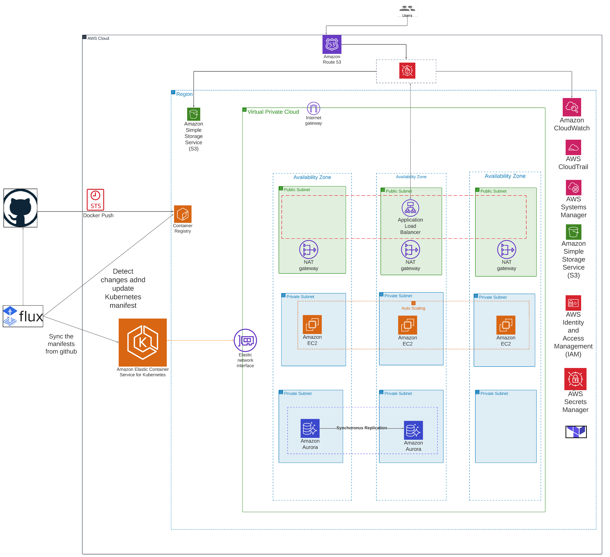

# WIP
## Infrastructure and Application Deployed.

- [x] GitHub Actions CI-Images are created  using Buildah and authentication is done using OIDC.

- [x] Flux 2 is bootsraped using Terraform Provider.

- [x] Terraform is used to create networking compute and storage layers on AWS, Terraform Cloud is used for state management.

- [x] Monitoring (AWS Cloudwatch Container Insights) and FluentD via FluxV2 and Kustomization. 

- [x] WAF is used to protect application and secrets are managed by KMS.

- [x] Scalability is managed by Cluster AutoScaler 
- [x] HPA -Flux-Kustomization
- [x] Ingress is created  using aws-alb-controller-Flux
- [x] Application  is Deployed via Flux Image Controllers.
-[x] RDS Backups are done via kubernetes cronjob.

## Documentation  is due

### Application Access-Dev
- dev-notejam.aqazi.xyz
- dev.grafana.aqazi.xyz
### Application Access-Prod
- prod.grafana.aqazi.xyz
- prod-notejam.aqazi.xyz

