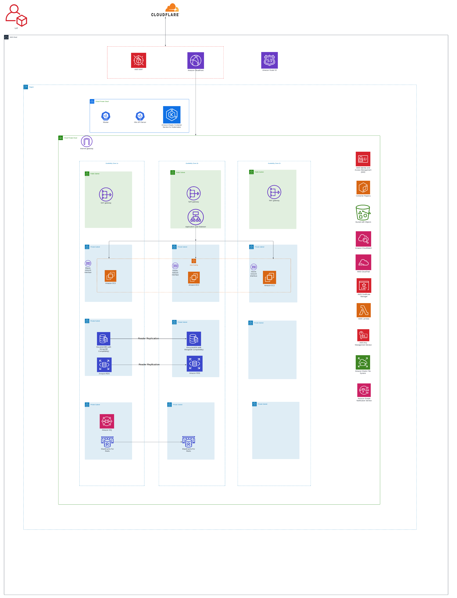

## Proposed Architecture


```
VPC Cost Estimation -07-07-2022
 Name                                                      Monthly Qty  Unit              Monthly Cost 
                                                                                                       
 module.mod_vpc.module.uat_vpc.aws_nat_gateway.this[0]                                                 
 ├─ NAT gateway                                                    730  hours                   $35.04 
 └─ Data processed                                      Monthly cost depends on usage: $0.048 per GB   
                                                                                                       
 module.mod_vpc.module.uat_vpc.aws_nat_gateway.this[1]                                                 
 ├─ NAT gateway                                                    730  hours                   $35.04 
 └─ Data processed                                      Monthly cost depends on usage: $0.048 per GB   
                                                                                                       
 module.mod_vpc.module.uat_vpc.aws_nat_gateway.this[2]                                                 
 ├─ NAT gateway                                                    730  hours                   $35.04 
 └─ Data processed                                      Monthly cost depends on usage: $0.048 per GB   
                                                                                                       
 OVERALL TOTAL                                                                                 $105.12 
──────────────────────────────────
```

